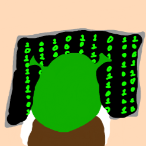

# Shrek--
A compiler for our language Shrek-- inspired by the DreamWorks Movie Shrek and extended universe.

## Description:
    Shrek-- is asdasd

## Examples:

    shilling = int
    enchanted = public
    cursed = private
    Donkey = String
    Pinoccio = boolean
    truth = true
    lie = false
    Ogre = Class

## About the Authors:

    Clayton Bruce is is an Oregonian who Enjoyed Shrek and other DreamWorks movies as a child. He frequently uses javascript and python and hopes to bring some form of pythonic list comprehensions to Shrek--. 
